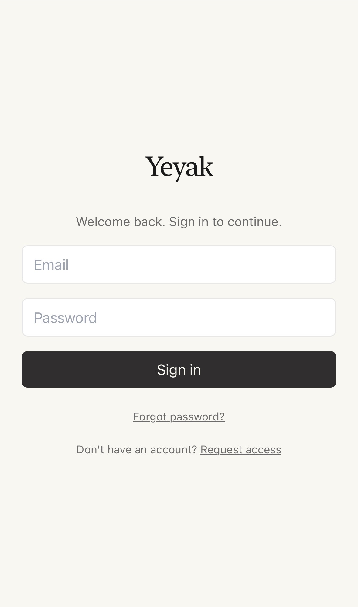
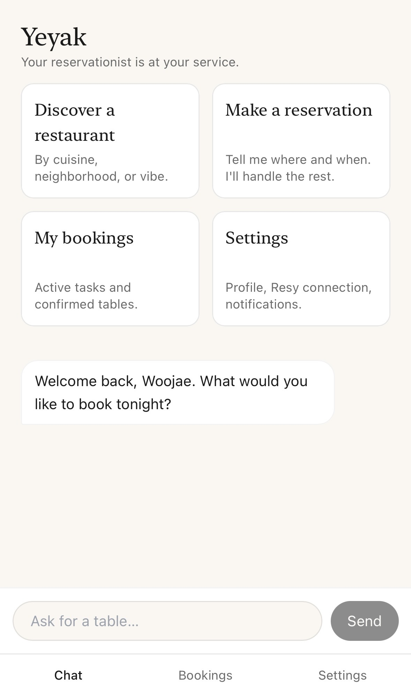
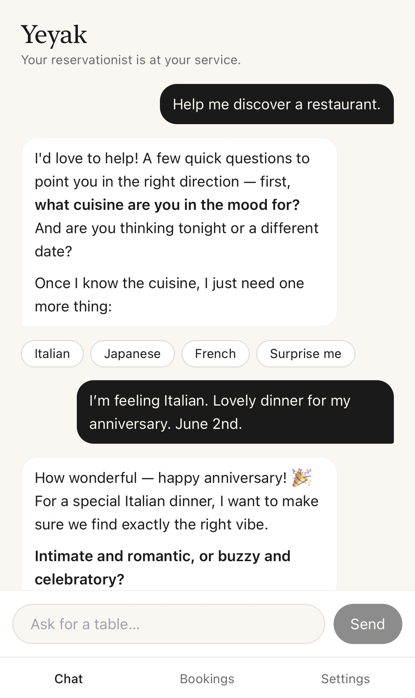
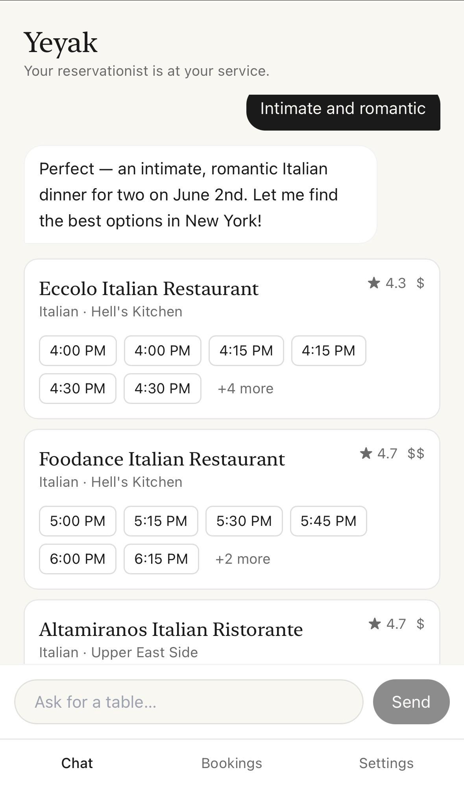
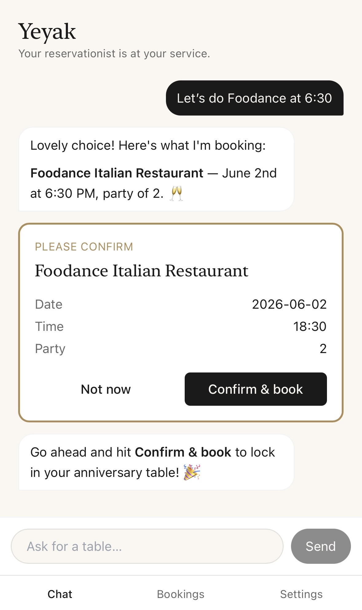
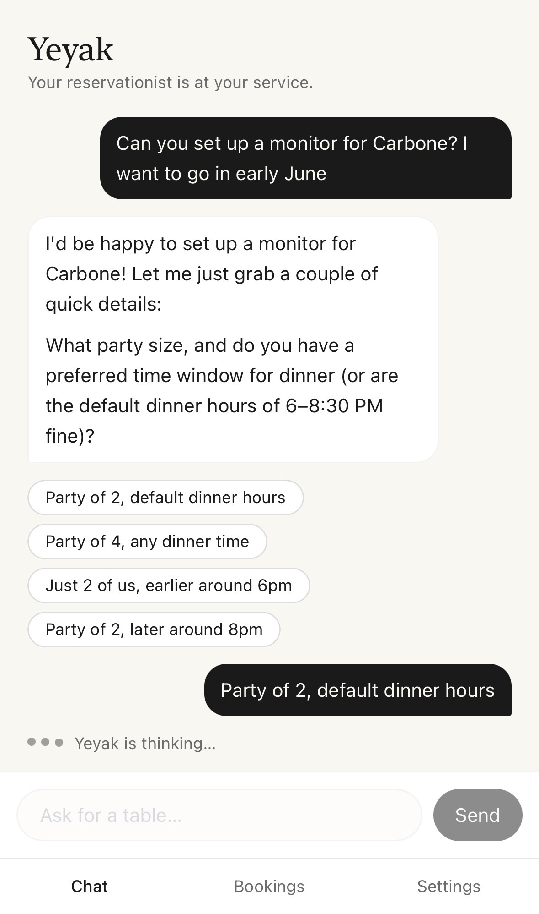
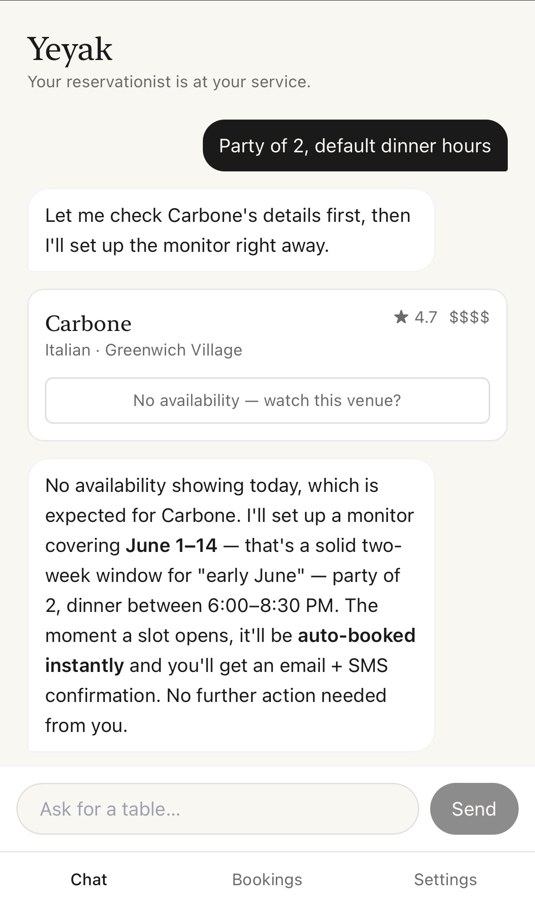
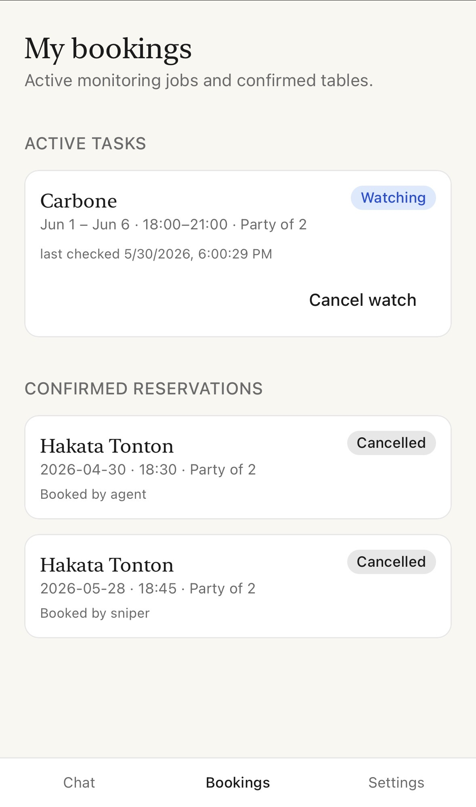

# 🍽️ Yeyak: An AI-Powered Restaurant Reservation Concierge

> **Note:** This project was built with heavy use of AI tools, primarily Claude. I provided all product requirements, architecture decisions, data models, and engineering specifications; Claude implemented the code under my direction.

**Yeyak** (예약 — *to reserve*, in Korean) is a mobile-first AI reservation concierge that books Resy restaurants for you. Instead of refreshing Resy hoping a cancellation surfaces, you chat with an AI reservationist, describe where and when you want to eat, and Yeyak handles the rest! It checks availability on the spot, books immediately if a slot is open, or sets up a background monitor that polls Resy with zero human overhead and books the moment one appears.

---

## Demo

  
  
  
  

 
  
  
  
  

---

## Key Features

- **Conversational Booking**: Chat naturally with an AI reservationist to discover restaurants by cuisine, vibe, location, party size, occasion, and more. The agent remembers core preferences such as preferred dinner time and party size, and uses these details to find and book restaurants.
- **Availability Check**: If a slot is open when you ask, Yeyak surfaces it immediately and books it after confirmation.
- **Monitoring**: Yeyak creates an active monitoring task for harder-to-book restaurants. A background worker polls Resy regularly and auto-books when a matching table opens.
- **Bookings**: See and manage your bookings, monitors, and more.
- **User Management**: Yeyak is invite-only. Admin accepts invitation requests and manages users.
- **Coming Soon**: iOS and Android app; integration with other reservation platforms (Tock, OpenTable, SevenRooms, etc.)

---

## Tech Stack

| Layer | Technology |
|---|---|
| Web App | Next.js 14 (App Router, TypeScript strict) |
| AI Agent | Anthropic Claude (`claude-opus-4-7`) |
| Background Worker | BullMQ + Redis |
| Database & Auth | Supabase (PostgreSQL + Auth + Vault) |
| Reservation API | Apify (`clearpath/resy-booker` MCP actor) |
| Frontend Hosting | Vercel |
| Worker Hosting | Railway |
| Email | Resend (TBD) |
| SMS | Twilio (TBD) |

---

## How It Works

### The AI Agent

Yeyak is a streaming agent exposed via a Next.js `/api/agent` route. The agent is equipped with 8 tools: `search_restaurants`, `check_availability`, `book_reservation`, `cancel_reservation`, `create_reservation_task`, `cancel_reservation_task`, `get_bookings`, and `suggest_replies`.

The agent is prompted to behave like a seasoned maître d'. It operates under several rules: it never books without surfacing a `ConfirmBookingCard` and receiving explicit user confirmation, always anchors to the current date (an important guard given LLM training cutoffs), and deduplicates repeated availability checks within a session to avoid redundant API calls and billing.

The full conversation transcript is preserved in `sessionStorage` and re-sent on each turn, giving the agent memory across a session. A `ChatContext` provider wraps the app shell so chat state survives tab navigation.

### The Sniper Worker (Railway + BullMQ)

The heart of Yeyak is its ability to monitor and autobook reservations. The sniper is a standalone Node.js worker deployed on Railway, running on a cron schedule every hour. On each tick it:

1. Fetches all `reservation_tasks` with `status = 'active'` from Supabase.
2. For each task, calls Apify to check availability across the full target date range.
3. If a matching slot is found, immediately calls Apify to book it using the user's stored Resy credentials.
4. Marks the task `'booked'`, writes a confirmed reservation row, and notifies the user via email (Resend) or SMS (Twilio) *(to be implemented)*.
5. Expires tasks whose target dates have passed.

One active monitor per venue per user is enforced by a partial unique index on the `reservation_tasks` table, preventing duplicate snipers from running for the same venue.

### Apify (`clearpath/resy-booker`)

Yeyak doesn't call the Resy API directly. All reservation actions are routed through Apify's hosted `clearpath/resy-booker` Standby actor, accessed via the Model Context Protocol (MCP). An internal MCP client manages lazy actor startup, connection retry on transient errors, caching of availability results within a session, and optimistic cost logging for every billable call:

| Action | Cost |
|---|---|
| Restaurant search | $0.03 |
| Availability check | $0.05 |
| Booking | $3.99 |

This approach keeps Resy integration self-contained and means the sniper and the chat agent share the exact same booking logic through one interface.

### Supabase

Supabase serves three distinct roles in Yeyak:

**Database** — Six core tables (`profiles`, `reservation_tasks`, `reservations`, `cost_events`, `activity_log`, `tool_call_log`) all protected by Row-Level Security policies. Users can only access their own rows; the background worker bypasses RLS via a service role key.

**Auth** — Email/password login with magic-link invites delivered through Resend. A Postgres trigger auto-creates a `profiles` row on every new signup.

**Secrets Manager** — Each user's Resy password is stored encrypted in Supabase Vault and retrieved only through a service-role-gated RPC (`get_resy_password`). Neither the web app nor the worker ever handles the raw credential outside of that call.

### Vercel

The Next.js web app is deployed on Vercel, which provides native Next.js streaming support for the agent's Server-Sent Events response, edge routing, and environment variable management. All user-facing interactions flow through here — login, onboarding, the chat interface, bookings, settings, and the admin dashboard.

### Railway

The sniper worker runs on Railway alongside a Redis instance (used by BullMQ for the job queue). The worker runs directly from TypeScript source via `tsx`, which keeps the deploy simple and the iteration cycle fast. The cron is managed by BullMQ's internal repeat scheduler rather than Railway's native cron, giving the worker full control over job lifecycle and retry behavior.
